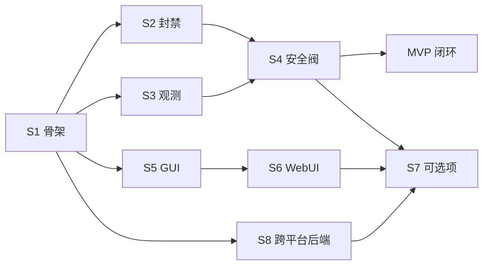

# BanIPHelper 项目流程总纲

本文是项目的**流程索引与并行策略**。架构决策与已核实的事实见 [architecture.md](architecture.md)，
不在本文重复。每个大流程（阶段）拥有独立文档，位于 `docs/phases/`。

## 1 文档地图

| 文档 | 内容 | 何时读 |
| --- | --- | --- |
| [handoff.md](handoff.md) | 交接与快速恢复：当前状态、下一步、协作约定、避坑 | 换环境或隔一段时间后 |
| [architecture.md](architecture.md) | 架构、技术选型、决策记录、已核实事实 | 想知道「为什么这么定」 |
| 本文 | 大流程划分、依赖、并行策略、里程碑 | 开工前与排期 |
| [phases/01-foundation.md](phases/01-foundation.md) | 阶段一：工程骨架与运行基座 | 阶段一起步 |
| [phases/02-filtering.md](phases/02-filtering.md) | 阶段二：封禁能力 | 骨架可用后 |
| [phases/03-observation.md](phases/03-observation.md) | 阶段三：观测能力 | 骨架可用后，与阶段二并行 |
| [phases/04-safety.md](phases/04-safety.md) | 阶段四：安全阀与自我保护 | 阶段二与阶段三收尾时 |
| [phases/05-gui.md](phases/05-gui.md) | 阶段五：GUI | 骨架可用后，与二三四并行 |
| [phases/06-webui.md](phases/06-webui.md) | 阶段六：WebUI | 阶段五主体完成时 |
| [phases/07-optional.md](phases/07-optional.md) | 阶段七：可选项与演进 | 核心闭环之后再谈 |
| [phases/08-portability.md](phases/08-portability.md) | 阶段八：跨平台后端 | 需要支持新平台时 |

## 2 大流程划分

### 2.1 七个阶段一览

| 阶段 | 名称 | 一句话目标 | 前置 |
| --- | --- | --- | --- |
| S1 | 工程骨架与运行基座 | 能启动、能提权、能存取、能干净退出的空壳，且 WFP 引擎可开关 | 无 |
| S2 | 封禁能力 | 规则模型到 WFP filter 的完整落地，含 IPv4 即时断连 | S1 |
| S3 | 观测能力 | 把「谁连了谁、多少流量」记录下来并可查 | S1 |
| S4 | 安全阀与自我保护 | 保证「封错」与「封死自己」不会发生 | S2、S3 |
| S5 | GUI | 可用的、好看的桌面界面 | S1 |
| S6 | WebUI | 远程与无界面访问，配置全量可改 | S5 |
| S7 | 可选项与演进 | 非闭环必需的能力，按需挑选 | S2、S3、S4 |
| S8 | 跨平台后端 | 把平台相关实现替换为另一个操作系统的后端 | S1 完成且接口冻结 |

### 2.2 依赖关系

关键判断：**S2 与 S3 之间没有依赖，S5 只依赖 S1**。这三者构成三条可并行的轨道。

## 3 并行策略

### 3.1 三条并行轨道

| 轨道 | 路径 | 说明 |
| --- | --- | --- |
| P 产品面 | S1 → S2 → S4 | 决定「能封得住」，是核心价值线 |
| O 观测面 | S1 → S3 → S4 | 决定「看得见」，与 P 轨道数据源不同、互不阻塞 |
| U 界面面 | S1 → S5 → S6 | 决定「好不好用」，靠接口层与 mock 数据先行 |
| X 平台面（按需） | S1 → S8 | 决定「能不能换平台」，接口冻结后即可独立推进 |

三条主线轨道在 **S4 完成**时汇合，即 MVP 闭环。平台面不参与闭环，按需启动。

### 3.2 并行前提：接口冻结清单

要让各条轨道真正并行，**S1 必须先把下列接口冻结**（头文件级定稿，实现可后补）。
这是「后续不再重新分步骤」的技术前提。接口分两层，**不允许跨层引用**。

核心接口，平台无关，位于 `core/` 侧：

| 接口 | 职责 | 供谁消费 |
| --- | --- | --- |
| `IRuleStore` | 规则增删改查与持久化 | S2、S5、S6 |
| `IRecorder` | 记录落库、聚合、保留期清理 | S3、S5、S6 |
| `IConfig` | 配置读写与校验、变更通知 | 全部 |
| `ISafetyGuard` | 白名单模式与回滚 | S4、S5、S6 |
| `ICapabilities` | 能力位集合的声明与查询 | 全部 |

平台接口，每个平台各实现一份，位于 `platform/<os>/`：

| 接口 | 职责 | 供谁消费 |
| --- | --- | --- |
| `IFilterEngine` | 规则到过滤器的下发与撤销 | S2、S4 |
| `ITargetResolver` | 进程标识解析与存活跟随 | S2、S5 |
| `IConnMonitor` | 连接快照与增量 | S3、S5、S6 |
| `ITrafficStats` | 字节统计 | S3、S5、S6 |
| `IKiller` | 指定连接的中断 | S2、S5 |
| `ISessionMonitor` | 系统事件订阅 | S3 |
| `IPrivilege` | 提权检测与申请 | 全部 |
| `ISingleInstance` | 单实例保证：取得所有权、唤起既有实例、**接收端** | S1 |
| `IAutoStart` | 开机自启注册与撤销 | S7 |
| `IPaths` | 配置与数据目录 | 全部 |

冻结含义：**签名与语义不再变，实现可以没有**。任何轨道若发现接口需要变更，
走第 6 节的变更控制流程，而不是就地改。

已发生的接口变更记录如下（每一次都要在两个后端与契约测试同步落地）：

| 时间 | 接口 | 变更 | 触发原因 |
| --- | --- | --- | --- |
| 2026-09-22 | `ISingleInstance` | 增加 `listenForActivation` 与 `stopListening` | S1.3 冻结时只写了发送端，接收端一直没有入口；S1.8 的托盘外壳要当接收端，而接收端只能落在 `platform/` 下。见 [phases/01-foundation.md](phases/01-foundation.md) 第 3.1 节的 S1.16 |

### 3.3 汇合点与里程碑

| 里程碑 | 达成条件 | 对应阶段 |
| --- | --- | --- |
| M1 空壳可用 | 提权托盘能启动退出，无残留 filter，配置与数据库可读写 | S1 |
| M2 封得住 | 能按进程封 IPv4/IPv6 的出站与入站，并能立即断 IPv4 连接 | S2 |
| M3 看得见 | 连接记录含 TCP/UDP 流量，可查可清 | S3 |
| M4 不怕封错 | 白名单模式带超时自动回滚，故障演练通过 | S4 |
| M5 MVP 闭环 | M2 到 M4 全部达成，GUI 可完成全部日常操作 | S2、S4、S5 |

**M1 已达成**（2026-09-22）：阶段一的八项验收逐条实测通过，证据见
[phases/01-foundation.md](phases/01-foundation.md) 第 5 节。

**M2 已达成**（2026-09-22）：「封 IPv4 与 IPv6 的出站与入站」逐条实测（
[phases/02-filtering.md](phases/02-filtering.md) 第 3.5 到 3.7 节），
「立即断 IPv4 已建立连接」也已实测（第 3.8 节）——
断掉之后重连会被已生效的规则拦住，而且「顺序反了会留一个重连窗口」这个反例也真跑了出来。
规则已经能跨重启活下来：清理残留 → 按库重建，重建之后真实连接确实被封住（第 3.9 节），
而且整条链路可以用一条命令重跑并核对过滤器条数与落点层（第 3.10 节）。
阶段二的九项验收里已有**八项**通过（只剩第 3 条里的「人话翻译」在 S5.6），详见第 5 节。

## 4 步骤编号与粒度

每个阶段文档内的步骤采用统一编号 `S<阶段>.<序号>`，例如 `S2.4`。每个步骤包含五项：

| 字段 | 含义 |
| --- | --- |
| 内容 | 这一步做什么 |
| 产出物 | 提交什么代码或文档 |
| 验收 | 怎么证明做完了 |
| 依赖 | 必须先完成哪些步骤 |
| 并行 | 能否与其他步骤同时进行 |

## 5 全局完成定义

一个步骤只有同时满足以下条件才算完成：

1. 产出物已提交，且能在本机工具链上构建通过
2. 验收方法已实际执行，不是「看起来对」
3. 若引入新的不确定点，已在文档中记录，而不是留在代码注释里
4. 没有残留的临时调试代码或临时文件散落在 `docs/` 与源码目录

工作约定见 [architecture.md](architecture.md) 第 0 节：临时文件统一放 `tmp/`。

## 6 变更控制

目标是**后续不再重新划分步骤**。为此约定：

| 情况 | 处理 |
| --- | --- |
| 新发现的工作 | 在所属阶段文档**追加**步骤编号（如 S3.9），不改动既有编号 |
| 步骤需要拆分 | 拆成 `S3.9a`、`S3.9b`，原编号保留为父步骤 |
| 步骤作废 | 标记为「已废弃」并注明原因，不删除编号 |
| 接口必须变更 | 更新第 3.2 节的冻结清单，并在受影响的阶段文档各加一条同步步骤 |
| 阶段目标变化 | 属于架构级变更，改 [architecture.md](architecture.md)，再回写本文 |

原则：**编号是稳定的引用锚点，宁可废弃也不重排**。

## 7 全局风险与假设

| 项 | 说明 |
| --- | --- |
| 独占型内核日志会话 | 老式内核日志会话与 WPR、xperf、部分杀软冲突，观测面必须优先用 manifest 版 provider |
| 提权调试体验 | 提权进程无法被普通权限调试器直接附加，需要另备调试方式，会影响 S1 与 S5 的效率 |
| 反作弊与杀软敏感度 | 若 S7 引入内核驱动方案，游戏反作弊可能误判，必须在 S7 实测后再定 |
| 精度期望 | 流量统计来自内核计数器与 ETW 事件，与网卡计数存在口径差，需在 S3 明确以谁为准 |
| 未知点集中区 | eStats 对老连接的有效性、ETW 的 UDP 事件是否含 PID，这两项在 S3 实测前不做承诺 |
| 取反条件的可读性 | 任意条件可取反会让规则变宽且不易察觉，因此宽条件必须被标记、规则必须能渲染成中文，并可用演练模式先行验证 |

---

## 8 跨平台抽象策略

平台差异**只允许出现在 `platform/` 下**。核心层与界面层只通过接口调用，
因此规则模型、规则求值、记录聚合、配置与存储、界面、WebUI 这些部分天然跨平台。

### 8.1 落地顺序（写代码时的固定动作）

1. 先在 `platform/api/` 定义接口，只描述要做什么，不描述怎么做到
2. 再在 `platform/win/` 写实现，并同时补一个内存实现
3. 用**同一套契约测试**同时验证内存实现与真实实现
4. 两者都通过之后，上层才开始调用

这条顺序是硬性要求：**先封装底层，再让上层调用**。反过来做就一定会把平台概念带进核心层。

### 8.2 硬约束

| 约束 | 说明 |
| --- | --- |
| 核心层与界面层不得引用平台专有头 | 由构建期检查强制，违反即构建失败 |
| 平台实现之间互不引用 | 公共代码只能下沉到 `core/` 或 `platform/api/` |
| 平台专有参数不上浮 | 参数留在实现内，接口只暴露通用语义 |
| 做不到的能力如实声明 | 经能力协商暴露，界面显式禁用，禁止静默失败 |

### 8.3 怎么判断一个功能是否跨平台

判断标准只有一条：**它是否需要调用操作系统专有的接口**。

- 需要，例如下发封禁、枚举连接、读取字节数、中断连接、提权、自启动、目录位置
  → 放进 `platform/`，按第 3.2 节的平台接口实现
- 不需要，例如规则解析、优先级求值、记录聚合、界面渲染、配置格式
  → 放进 `core/` 或 `ui/`，只写一次

细节见 [phases/08-portability.md](phases/08-portability.md) 与
[architecture.md](architecture.md) 第 12 节。
