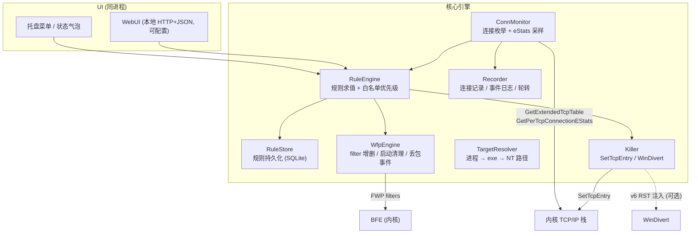

# BanIPHelper 核心架构规划

> 本文是**架构与决策依据**，回答「为什么这么定」。
> 流程划分、并行策略与阶段文档见 [README.md](README.md)。
>
> 目标：一个**系统级**的 IP 封禁工具，用**匹配条件**圈定作用范围（进程、地址、端口、协议、方向），
> **记录**所有新出现的对端连接，由用户**手工封禁**，能主动**断掉指定连接**，
> 覆盖 TCP/UDP、远端端口、IPv4/IPv6、出站/入站，且**低占用**。

---

## 0. 环境与约束（已实测）

| 项 | 情况 | 影响 |
| --- | --- | --- |
| OS | Windows 11，64 位 | 无域策略，但 WFP 与 BFE 正常可用 |
| 管理员 | 用户可提权 | WFP、`SetTcpEntry`、ETW 全部可用 |
| VS / WDK / Windows SDK | **全无** | 排除内核驱动；但**不影响**用户态 WFP |
| Qt | Qt 6，含 Qt Quick、Quick Controls、Svg、Charts | 已定稿，Qt Quick 做界面 |
| 编译器 | Qt 套件自带的 MinGW 工具链（GCC 13，x86_64） | 与 Qt 同源，勿与系统里另一套 MinGW 混用 |
| 构建 | CMake 与 Ninja，随 Qt 安装一并提供 | 整链齐全，不需要 MSVC |
| WFP 头文件 | `fwpmu.h`、`fwptypes.h`、`tcpestats.h`、`iphlpapi.h`、`tcpmib.h`、`evntrace.h` | 全部存在，不需要 Windows SDK。**但 `fwpmu.h` 不含 `FWPM_LAYER_*` 与 `FWPM_CONDITION_*` 常量**，这两类 GUID 要自己维护，见第 10 节 |
| WFP 导入库 | `libfwpuclnt.a`、`libiphlpapi.a`、`libws2_32.a`、`libwevtapi.a` | 全部存在 |
| 抓包 | Npcap 已装，WinDivert 未装 | 需要时再引 WinDivert |
| 其他 | Python 3 与 Node 已装 | Python 仅用于 `tmp/` 下的一次性冒烟验证，不入库 |

> **本机的绝对路径、版本号与构建命令见环境文档**（放在 `tmp/` 下，不入库）。
> 本文档只保留与机器无关的约束。
>
> **已核对**：工具链中内核态 WFP 的头文件缺失，而用户态 WFP 的头文件与导入库齐全，
> 与「不做驱动」的决策正好一致。

### 0.1 工作约定

- 临时文件一律放 `workspace/tmp/`（即 `d:\FDM\baniphelper\tmp\`），不放 `%TEMP%`
- 需要澄清时**优先用提问工具**，不在正文里追问
- 终端环境不限于 PowerShell，可用 git bash / cmd / WSL；**若要切换，先在本企划书里写明**

### 0.2 明确的非目标

不做内核驱动；不做逐包用户态处理（除非某个特性非它不可）。

---

## 1. 技术选型结论

### 1.1 一句话原则

> **数据面留在内核，用户态只做控制面。**

封禁的**执行**由用户态下发的 WFP filter 交给 BFE（Base Filtering Engine）在内核完成。
所以「低占用」的关键不是用哪个语言，而是**不要让包进用户态**。

### 1.2 分工

| 关注点 | 方案 | 是否逐包进用户态 |
| --- | --- | --- |
| 封禁执行 | 用户态 WFP filter（`fwpuclnt.dll`） | ❌ 内核执行，空闲零成本 |
| 进程定位 | `FWPM_CONDITION_ALE_APP_ID` + NT 设备路径 | ❌ |
| 连接发现 | ETW `Microsoft-Windows-Kernel-Network`（事件驱动）+ 轮询兜底 | ❌ |
| 流量统计 | TCP 扩展统计 `TCP_ESTATS_DATA_ROD_v0`（读内核计数器） | ❌ |
| 主动断连 | `SetTcpEntry`（IPv4） | ❌ |
| IPv6 即时断连（可选） | WinDivert（用户态，逐包） | ✅ 仅阶段七按需引入，非任何阶段的前置依赖 |

### 1.3 技术栈（定稿）

| 层 | 选型 |
| --- | --- |
| 语言 | **C++17**（必要时用 C++20） |
| 框架 | **Qt 6**（Qt Quick 做界面，Widgets 做托盘与辅助） |
| 构建 | **CMake + Ninja**，工具链用 Qt 套件自带的 MinGW |
| 数据面 | Win32 API 直调：WFP（`fwpuclnt`）/ IP Helper / ETW |
| 不引入 | MSVC、Windows SDK、Rust、C#、任何第三方 WFP 封装库 |

> ⚠️ **不要用系统里另一套 MinGW 去链 Qt**（例如开发环境自带的 gcc）。
> 两套 MinGW 的 CRT 与运行时可能不一致，全项目统一使用 Qt 套件自带的那一套。

Python 只用于 `tmp/` 下的一次性冒烟验证（例如确认 WFP 语义、验证 eStats 能否读到值），
**不作为产品代码**。

---

## 2. 交付形态与模块

### 2.1 交付形态：提权托盘单进程

**提权托盘单进程**，不做服务。引擎与 UI 在同一个进程里，不拆 IPC。
理由：单进程最简单，且托盘进程本来就需要管理员权限（WFP 与 `SetTcpEntry` 都要提权）。

提权托盘必须处理的四个坑：

| 坑 | 应对 |
| --- | --- |
| **开机自启** 不能用注册表 `Run` 键（无法带 UAC 提权） | 用**计划任务**，勾选「使用最高权限运行」 |
| **UIPI**：普通权限进程无法给提权进程发窗口消息 | 外部控制一律走 **本地 HTTP（WebUI）** 或命名管道，不用 `SendMessage` |
| **进程退出后 WFP filter 仍在内核存活**（simplewall 同样现象） | ① 所有 filter 挂在自己的 provider / sublayer 下；② 每次启动先清理孤儿 filter；③ 提供「退出时撤销全部规则」开关 |
| **重复启动** 会重复下发 filter | 单实例锁（命名 Mutex），已有实例则唤起托盘并退出 |

### 2.2 GUI 技术选型：Qt Quick

已核对套件内容：`Qt6Quick`、`Qt6Qml`、`Qt6QuickControls2`、`Qt6Svg`、`Qt6Charts` 齐全，
`qml/` 下有 `QtQuick`、`QtQuick3D`、`QtCharts`。观感上限足够，不需要退到 Widgets。

| 方案 | 取舍 |
| --- | --- |
| **Qt Quick (QML)**，选它 | 自带现代控件与动画、矢量渲染、列表可跑满帧；深色主题与自定义控件成本低 |
| Qt Widgets + QSS | 传统桌面观感、原生度更高，但「好看」要自己啃样式表 |

「做好看点」的具体落点（避免沦为一句空话）：

- 深色主题 + 自绘无边框窗口（自绘最小化与关闭按钮，标题栏可拖拽）
- 卡片式分区：目标进程、连接记录、规则、统计各占一张卡
- 连接列表用 `TableView` + 虚拟化，支持按流量与时间排序、支持搜索
- 流量曲线用 `QtCharts` 实时滚动，列表行内加迷你趋势图
- 列表行右侧悬浮「封禁」一键操作，不做多层弹窗
- 状态栏常显：生效规则数、白名单模式倒计时、累计拦截包数

**许可后果（2026 年 9 月 21 日查证）**：`QtCharts` 与 `QtHTTPServer` 都属于
**仅商业或 GPLv3** 的模块 —— Qt 官方文档的原话是这些模块不提供 LGPLv3 那一档
（Qt Charts 自 6.10 起还被官方废弃，建议改用 Qt Graphs）。
用到其中任何一个，整个程序就必须按 GPLv3 分发。既然两条都已在规划里，
本项目定为 **`GPL-3.0-or-later`**，见根目录 [LICENSE](../LICENSE)；
各第三方组件及其许可集中列在 [README.md](../README.md) 的「第三方组件的许可」一节。
其余模块（Core、Gui、Qml、Quick、QuickControls2、Svg、Sql、Network、Test）为 LGPLv3。
反过来说，项目按 GPLv3 发布时，LGPLv3 那批模块的额外义务被更强的条款自动覆盖。

### 2.3 模块结构



| 模块 | 职责 | 关键 API |
| --- | --- | --- |
| `RuleStore` | 规则 CRUD + 持久化 | SQLite |
| `WfpEngine` | 建删 filter，维护 filter 与规则的映射，启动清理 | `FwpmEngineOpen0` `FwpmFilterAdd0` `FwpmFilterDeleteById0` |
| `TargetResolver` | 进程选择、exe 路径到 NT 路径、进程存活跟随 | `QueryDosDevice` `GetProcessImageFileName` |
| `ConnMonitor` | 连接快照与增量、字节计数 | `GetExtendedTcpTable` `GetExtendedUdpTable` `GetPerTcp6ConnectionEStats` |
| `Recorder` | 记录每个**新出现**的进程、协议、远端地址与端口组合，去重、累计、轮转 | SQLite |
| `RuleEngine` | 规则求值、白名单优先级、手工封禁下发 | 无 |
| `Killer` | 主动断连 | `SetTcpEntry`（IPv4）；WinDivert（IPv6，可选） |

---

## 3. WFP 过滤层选择

这是整个方案的技术核心。所有层都有 IPv4 与 IPv6 两个版本，按规则里的网段自动分派。

| 场景 | 层 | 过滤条件 |
| --- | --- | --- |
| 出站新连接（TCP 与 UDP 都走这里） | `FWPM_LAYER_ALE_AUTH_CONNECT_V4` / `_V6` | `ALE_APP_ID` + `IP_REMOTE_ADDRESS` 加 `IP_PROTOCOL`、`IP_REMOTE_PORT` |
| 入站新连接（阻止对方连我） | `FWPM_LAYER_ALE_AUTH_RECV_ACCEPT_V4` / `_V6` | 同上，另加 `IP_LOCAL_PORT` |
| 入站 UDP 数据报 | `FWPM_LAYER_DATAGRAM_DATA_V4` / `_V6` | `IP_REMOTE_ADDRESS` + `IP_PROTOCOL=17` + `IP_LOCAL_PORT` |
| IP 级兜底（可选，更狠） | `FWPM_LAYER_INBOUND_TRANSPORT_V4` / `_V6` | `IP_REMOTE_ADDRESS` |

> ⚠️ **最重要的一条**：`ALE_AUTH_*` 只在**连接建立时判定一次**。
> 新加的封禁规则**不会**断开已经建立的连接，必须由 `Killer` 主动断。

### 3.1 路径转换（最常见的踩坑点）

`ALE_APP_ID` 需要 **NT 设备路径**，不是 `C:\...`：

```text
C:\Program Files\Foo\foo.exe
  → \Device\HarddiskVolume3\Program Files\Foo\foo.exe
```

用 `QueryDosDevice("C:", ...)` 拿到 `\Device\HarddiskVolumeN` 再拼接。

---

## 4. 数据模型与匹配模型

### 4.1 匹配模型的定位

「针对谁」不做成「可选目标」与「全系统」二选一，而是统一为**匹配条件**。
「全系统」只是「程序域取全部」的一个普通取值，不需要单独开关。

一条规则由若干**匹配条件**组成，**全部条件同时满足**才算命中。
条件分域，域内多个值取并集，域之间取交集。

### 4.2 规则结构

```text
Rule {
  id          : string
  action      : "block" | "allow"     // allow 优先于 block，用于白名单模式
  conditions  : [ Condition, ... ]    // 全部满足才命中；不允许为空
  enabled     : bool
  expire_at   : timestamp?            // 自动过期，用于「封 M 分钟」
  note        : string?
  schema      : int                   // 规则格式版本，便于后续迁移
}

Condition {
  domain : "proc" | "addr" | "port" | "proto" | "direction"   // 可扩展
  mode   : string                     // 该域下的匹配方式，见 4.3
  values : [ string, ... ]
  negate : bool                       // 取反，满足本条件的反面
}
```

### 4.3 各域的匹配方式

程序域，`domain = "proc"`：

| mode | 语义 | 示例 | 落地阶段 |
| --- | --- | --- | --- |
| `exact` | 单个可执行文件全路径 | 一个 exe | 阶段二 S2.1 |
| `set` | 多个可执行文件 | 若干 exe | 阶段二 S2.1 |
| `any` | 所有进程 | 无 | 阶段二 S2.1 |
| `wildcard` | 按路径或文件名通配 | `*\chrome.exe` | 阶段二 S2.11 |
| `dir` | 某目录下的全部可执行文件 | `D:\games\A\` | 阶段二 S2.12 |

地址域，`domain = "addr"`：

| mode | 语义 | 示例 |
| --- | --- | --- |
| `exact` | 单个地址 | `1.2.3.4` |
| `cidr` | 网段 | `1.2.3.0/24`、`2001:db8::/32` |
| `range` | 地址范围 | `1.2.3.4-1.2.3.9` |
| `any` | 不限地址 | 无 |

其余域：

| domain | mode 取值 |
| --- | --- |
| `port` | `exact`、`range`、`set`、`any` |
| `proto` | `tcp`、`udp`、`any` |
| `direction` | `out`、`in`、`both` |

### 4.4 匹配语义

- 条件之间是**交集**：一条规则命中的前提是所有条件都满足
- 条件之内是**并集**：`values` 中任一命中，该条件即满足
- `negate` 作用于**该条件整体**，等价于「不在这个集合里」
- **`conditions` 不允许为空**。要表达「全部」必须显式写一个 `mode = any` 的条件，
  让审阅者一眼看到「这是全部」，而不是靠留空隐式得到
- `allow` 优先于 `block`；同类型规则的优先级按条件具体度排序，见 4.6

### 4.5 可扩展性

- `domain` 与 `mode` 都是枚举加注册表：新增一个域只需新增一个求值器，**规则结构不变**
- 每条规则带 `schema` 版本号，格式变更时按版本迁移
- 遇到未知的 `domain` 或 `mode` 时**拒绝加载该条规则并报错**，绝不宽松解释。
  宁可这条规则不生效，也不能按错误语义去封禁

### 4.6 具体度与优先级

条件越具体，优先级越高，顺序为：

`exact` > `set` > `dir` > `wildcard` > `any`

`negate = true` 的条件按「排除」看待，具体度略高于同 mode 的非取反形式。
同具体度时以规则创建时间**较早**者优先，保证结果稳定可复现。

### 4.7 风险分级与演练

属于**宽条件**的有：`mode = any`、`negate = true`、`proto = any`、`direction = both`，
以及过于宽泛的 `wildcard`。

- 一条规则里宽条件达到 **2 个**即判定为高风险，**3 个及以上**为极高风险
- 高风险规则在下发前必须二次确认，确认界面要显示**预估影响**：会命中多少个进程、多少条现存连接
- **演练模式**：任意规则都可选择「只记录不下发」，跑一段时间看它会命中谁，确认无误再启用。
  这是一个普通选项，默认关闭

### 4.8 人话翻译

因为任意条件都可以取反，规则的可读性会下降，所以界面**必须**把每条规则渲染成一句中文，
例如「对所有进程，封禁与 `1.2.3.0/24` 之间除 `tcp` 443 之外的全部出入站连接」。
没有这句翻译，规则审阅不可靠，而本项目的错误代价是断网。

### 4.9 运行态与展开

```text
filter_id → rule_id        // 撤销与热更新时精确删除
rule_id  → [filters...]    // 撤销该规则时精确删除
```

规则到 filter 的展开：一条规则按「方向、地址族、入站 UDP」三个维度展开成 N 条 filter，
用一个 WFP 事务（`FwpmTransactionBegin0` 与 `FwpmTransactionCommit0`）批量提交，避免中间态。
三个维度都对应平台的层边界，无法合并，所以条数最多 3 × 2 = 6。

**取值个数不是展开维度**：同一条 filter 里同一个字段可以出现多个条件，语义是「或」，
所以「多个地址」「多个端口」只让条件变多，不让 filter 变多。
这一点由 S2.2 实测确认，依据与复现脚本见
[phases/02-filtering.md](phases/02-filtering.md) 第 3.2 节。

> ⚠️ 取反**不能**跟着合并。`addr ∉ {A, B}` 写成「≠A 或 ≠B」恒真，
> 等于把地址条件整个丢掉，规则会比预期**封得宽** —— 这是最难发现的错误方向。
> 取反必须先求补，再用补集里的正向取值各出一个条件。

---

## 5. 关键机制

### 5.1 流量统计

**结论：TCP 和 UDP 都能在「不引入任何驱动」的前提下拿到字节数。**

| 协议 | 方案 | 说明 |
| --- | --- | --- |
| TCP | `GetPerTcpConnectionEStats` 到 `TCP_ESTATS_DATA_ROD_v0` | `DataBytesIn`、`DataBytesOut`、`DataSegsIn`、`DataSegsOut` |
| UDP | **ETW `Microsoft-Windows-Kernel-Network`** | **已核实事件自带字节数**，见下 |

> ⚠️ eStats **必须先启用采集**：默认关闭，需对每条连接先调 `SetPerTcpConnectionEStats`
> 打开 `TCP_ESTATS_DATA_RW_v0.enableCollection`，否则读不到。实操上在**连接刚被发现时**就启用。
> 另外本机头文件已确认：**不存在 UDP 版的 per-connection eStats**（只有 `tcpestats.h`），
> 所以 UDP 只能走 ETW。

#### 5.1.1 UDP 走 ETW 的依据（已在本机核实）

`Microsoft-Windows-Kernel-Network`（GUID `{7DD42A49-5329-4832-8DFD-43D979153A88}`）
的 provider manifest 中明确存在下列事件：

| 事件 ID | 消息模板 | 关键字 |
| --- | --- | --- |
| 42 | `UDPv4: %2 bytes transmitted from %4:%6 to %3:%5.` | IPv4 |
| 43 | `UDPv4: %2 bytes received from %4:%6 to %3:%5.` | IPv4 |
| 49 | `UDPv4: Connection attempt failed with error code %2.` | IPv4 |
| 58 | `UDPv6: %2 bytes transmitted from %4:%6 to %3:%5.` | IPv6 |
| 59 | `UDPv6: %2 bytes received from %4:%6 to %3:%5.` | IPv6 |

同一 provider 的 TCP 事件同样带字节数（transmitted、received、retransmitted）。

- **带字节数**：模板中的 `%2` 即 size ✅
- **带地址与端口**：`%3` 到 `%6` 分别是 daddr、saddr、dport、sport ✅
- **带 PID**：模板从 `%2` 起用，`%1` 未在消息中展示，该字段存在但未显示，按同类 TCP 事件惯例应为 PID
  - 旁证：微软 TraceEvent 库中同类 UDP 事件的字段表同时暴露 `size`、`saddr/sport/daddr/dport` 与进程 ID
  - **此项须在阶段三的 S3.3 实测确认**（起一个 ETW 会话读一条真实 UDP 事件即可）

> ⚠️ 老式 `MSNT_SystemTrace` 内核日志会话是**独占**的（与 WPR、xperf、某些杀软冲突）。
> 优先订阅上面的 manifest 版 provider 做实时统计，避免开 NT Kernel Logger 会话。

按需采样：只在统计界面打开时开 ETW 订阅与 eStats 采样；周期 1 到 2 秒，且只针对目标进程的连接。

### 5.2 主动断连（已实测确认的边界）

| 协议 | 方案 | 约束 |
| --- | --- | --- |
| IPv4 TCP | `SetTcpEntry` + `MIB_TCP_STATE_DELETE_TCB` | 需管理员 + **提权清单**（`requireAdministrator`）；只能设这一个状态；仅 IPv4。**立即发 RST** |
| IPv6 TCP（即时） | ⚠️ 需 **WinDivert** 注入 RST | 第三方库 + **自带内核驱动**（**不是** Windows SDK 功能），见下 |
| IPv6 TCP（零依赖兜底） | 在传输层丢包，卡死该流 | 无系统 API 可即刻断；丢包后连接挂起直至超时。达成「连不上」的语义，但资源不立即释放 |
| UDP | 无连接语义 | 封禁规则生效后自然停止，无需断 |

> 断连时机的选择：**先下发封禁规则，再断现有连接**。
> 否则对端可能在被断的瞬间重连成功。

#### 5.2.1 为什么 IPv6 断连非要用第三方驱动

Windows 的 Winsock raw socket 有硬限制（官方文档原文）：
**「TCP data cannot be sent over raw sockets」**，且 `bind` 对 `IPPROTO_TCP` 的 raw socket 不被允许。
即**能建套接字，但不能发 TCP 报文**，因此无法自行构造 RST。这不是「没找对 API」，是系统层面禁止。

#### 5.2.2 WinDivert 是什么

| 项 | 说明 |
| --- | --- |
| 性质 | **第三方**库（`basil00/Divert`，LGPL），**不是** Windows SDK 功能 |
| 形态 | 用户态 API + **内核驱动**（自带 `WinDivert.sys`） |
| 签名 | 官方发布的驱动已由赞助商签名，x64 上开箱可用，**不需要测试签名模式** |
| 权限 | 加载驱动必须有管理员权限（我们本来就有） |
| 能力 | 捕获、丢弃、嗅探、注入、修改包，完整 IPv6 支持 |
| 代价 | ① 逐包进用户态，有拷贝开销（与低占用冲突）；② **游戏反作弊与杀软高度敏感**，易误判；③ 自行重编译需自己签名；④ LGPL 需遵守许可 |

> **结论：IPv6 即时断连不做。** 默认走「传输层丢包卡死」这条零依赖兜底；
> 真到了非即时断不可的场景，再评估引入 WinDivert（见阶段七 S7.1）。

### 5.3 触发策略（记录优先，封禁全手工）

**不实现自动封禁**（无阈值触发、无冷却逻辑），策略显著简化：

1. **全量记录**：凡是**新出现**的进程、协议、远端地址与端口组合一律落库，
   带首次与末次时间、累计字节、命中次数。已存在的组合只更新计数，不重复写新行。
2. **手工封禁**：用户从记录列表里挑一条（或手填地址与网段）生成规则并下发 filter。
   支持 `expire_at` 做「临时封 M 分钟」。
3. 两条路径产出**同一种规则对象**，走同一条下发链路。

> 记录量会很大，写入策略见第 8 节。记录是**观察手段**，不是触发手段。

---

## 6. 白名单模式

### 6.1 语义

- `action=allow` 的规则**优先级高于** `block`（用 sublayer 权重实现，allow 权重更高）
- **白名单模式**是「默认阻断 + 例外放行」，与常规的「默认放行 + 指定阻断」互为开关

### 6.2 实现

- 使用独立的 sublayer，权重高于普通规则；白名单模式的默认阻断是一条**无实体条件**的 block filter
- 切到白名单模式时，**先下发全部 allow 规则，最后才下发默认阻断**（顺序不能反）

### 6.3 内置必备放行（否则一开就断网或断自己）

| 放行项 | 原因 |
| --- | --- |
| 回环 `127.0.0.0/8` 与 `::1` | 本机通信 |
| DHCP（UDP 67 与 68） | 否则租约到期直接掉线 |
| DNS（UDP 与 TCP 53） | 否则一切域名解析失败 |
| **自身进程 exe** | 白名单模式不能把自己封掉 |
| **WebUI 监听端口** | 否则没有界面可以恢复 |
| NCSI 与连通性探测 | 否则任务栏网络图标报无网 |

### 6.4 安全机制：超时自动回滚（硬性要求）

切换白名单模式时启动倒计时（默认 60 秒）：期间若未在界面上确认保留，则自动回滚到上一个可用配置。

> 这是防「把自己彻底锁死」的唯一可靠手段，**不可省略、不可关闭**。

---

## 7. WebUI 与配置

> **阶段：排在 GUI 之后**（见 [phases/06-webui.md](phases/06-webui.md)）。
> GUI 是一等公民，WebUI 是无界面与远程访问的补充。
> `QHttpServer` 模块当前未安装，需要时用 Qt 在线安装器补装即可。

### 7.1 传输

- 本地 HTTP + JSON（Qt 自带 `QTcpServer`，或 Qt 6 的 `QHttpServer`）
- 默认绑定 **`127.0.0.1`**，可配置为 `0.0.0.0` 以支持局域网访问
- 可选鉴权：首次启动生成 Token 写入配置；**开启局域网访问时强制要求 Token**
- 端口默认 `18471`（可配置），被占用时自动递增

### 7.2 配置项（每一项都要能在 WebUI 里改）

下表是**规划中的全集**。真正生效的清单是代码里的配置描述符表
（`src/core/config_descriptors.h`），只有被消费的项才会进去。
描述符表里的键名一律带命名空间前缀，因此本表里的名字在落地时会写作
`webui.listen_port`、`record.retention_days` 这样的形式；
已经落地的项直接把本表的键名改成了带前缀的写法（见 `shutdown.revoke_on_exit`）。

| 配置 | 默认 | 说明 |
| --- | --- | --- |
| `listen_address` | `127.0.0.1` | 绑定地址 |
| `listen_port` | `18471` | 端口 |
| `auth_enabled` 与 `token` | 开，随机生成 | 鉴权 |
| `record_connections` | 开 | 是否记录新出现的连接 |
| `record_retention_days` | 7 | 记录保留期 |
| `sample_interval_ms` | 1000 | 采样间隔，无界面时自动降频 |
| `shutdown.revoke_on_exit` | 开 | 退出时是否撤销全部 filter（托盘菜单里的勾选项就是它） |
| `whitelist_mode` | 关 | 白名单模式 |
| `whitelist_rollback_seconds` | 60 | 超时自动回滚秒数 |

### 7.3 存储

- **SQLite**：规则表与连接记录表（记录量很大，JSON 不合适）
- 配置本身用 **JSON**（人可读、方便手改）；导出与备份即打包两者
- 位置：`%APPDATA%\BanIPHelper\`

---

## 8. 低占用设计要点

- **空闲时零轮询**：连接发现走 ETW 事件，不用定时全量枚举。
- **过滤不进用户态**：BFE 内核执行，进程空闲时 CPU 占用为 0。
- **计数器代替抓包**：流量统计读内核计数器，不复制字节。
- **记录写入是新的瓶颈**（因为「只要出现就记录」）：**SQLite WAL + 批量事务提交**，
  不要每条一次事务。
- **WinDivert 默认不引入**：它逐包进用户态且有反作弊风险；只有非即时断不可时才临时启用，用完即卸。
- **采样自适应**：无界面时降到 5 秒一次或完全关闭。

---

## 9. 与流程文档的关系

阶段划分、步骤编号与并行策略以流程文档为唯一来源，本文不再重复维护阶段清单。

| 阶段 | 名称 | 文档 |
| --- | --- | --- |
| S1 | 工程骨架与运行基座 | [phases/01-foundation.md](phases/01-foundation.md) |
| S2 | 封禁能力 | [phases/02-filtering.md](phases/02-filtering.md) |
| S3 | 观测能力 | [phases/03-observation.md](phases/03-observation.md) |
| S4 | 安全阀与自我保护 | [phases/04-safety.md](phases/04-safety.md) |
| S5 | GUI | [phases/05-gui.md](phases/05-gui.md) |
| S6 | WebUI | [phases/06-webui.md](phases/06-webui.md) |
| S7 | 可选项与演进 | [phases/07-optional.md](phases/07-optional.md) |
| S8 | 跨平台后端 | [phases/08-portability.md](phases/08-portability.md) |

### 9.1 范围界定

- **初期只做 IPv4 掐断**：IPv4 有 `SetTcpEntry` 可立即发 RST，**完全不需要 WinDivert**
- **WinDivert 全程按需**：UDP 统计已确认可走 ETW，因此它不再是任何阶段的前置依赖；
  只有「必须对 IPv6 立即断连」这一种场景才引入，可推到阶段七
- IPv6 在阶段二即支持**封禁**（过滤层都有 IPv6 版本），只是「断」降级为丢包卡死

> 阶段一起就直接用 C++ 与 Qt，不做「先写原型再迁移」。
> 但 WFP 语义、eStats 可读性、ETW 字段这类**不确定点**，允许在 `tmp/` 下写一次性脚本先验证。

---

## 10. 风险与待验证

| 项 | 说明 |
| --- | --- |
| **白名单模式把自己锁死** | ⚠️ 最高风险项，超时自动回滚是硬性要求 |
| 计划任务自启 | 提权托盘必须靠计划任务（注册表 Run 键带不了提权），首次配置需引导用户或提供一键注册脚本 |
| 退出后 filter 残留 | 崩溃时更明显。启动清理逻辑必须有，且要能区分「这是不是别的工具（如 simplewall）的 filter」 |
| WFP 层与条件 GUID 需自建 | 工具链的 WFP 头不含 `FWPM_LAYER_*` 与 `FWPM_CONDITION_*`，导入库也不导出这些符号，需自建常量表并**逐个校验**。写错的后果很隐蔽：过滤器落在别的层上，规则看着下发了却不起作用，且不报错。系统里层的名字是资源串，认不出是哪一层，校验只能靠 `FwpmLayerEnum0` 比对 GUID |
| 过滤器枚举必须按层 | 枚举模板的 `layerKey` 不能留空，否则 `FWP_E_LAYER_NOT_FOUND`。因此「找出自家全部过滤器」只能是逐层枚举。**不许改成写死的层清单**：清单忘了增补时，那一层上的旧过滤器就永远清不掉，而清理还会报成功 |
| 记录量爆炸 | UDP 与短连接场景可能每秒数百条，需批量写入加保留期，并允许整体关闭 |
| eStats 启用时机 | 对「已经存在很久」的连接启用后能否立刻读到累计值，**需实测**（阶段三 S3.2） |
| UDP 流量统计 | **方案已定：走 ETW**（Kernel-Network 的 UDP 事件自带字节数）。残留风险仅为事件是否含 PID，阶段三 S3.3 实测 |
| IPv6 断连 | 无系统 API（raw socket 禁发 TCP）。默认用丢包卡死兜底；WinDivert 是第三方内核驱动且反作弊与杀软敏感，只在必须即时断时才引入（阶段七 S7.1） |
| 长连接反复重连 | BT 与游戏被断后常立刻重连，必须「持续封禁」而非「一次性断」 |
| 两套 MinGW 混用 | 统一用 Qt 套件自带的那一套，别混开发环境自带的 gcc |
| 默认全阻断 | ⚠️ 非白名单模式下**不许**实现「默认阻断一切」 |

---

## 11. 已决策与待决策

### 11.1 已决策

1. Qt 套件自带 MinGW 工具链，构建用 CMake 与 Ninja，不需要 MSVC
2. 形态：**提权托盘单进程**，不做服务
3. 触发策略：**只记录、不自动封禁**，封禁全部手工
4. 白名单模式：**做**
5. GUI：**Qt Quick** 做完整界面，**明确要求美观**，属于界面面的第一优先级
6. WebUI：**做，但排在 GUI 之后**，要求一切可配置
7. **初期只做 IPv4 掐断**（`SetTcpEntry` 立即发 RST），不引入 WinDivert
8. **UDP 流量统计走 ETW**（已核实其事件自带字节数），因此**不需要为 UDP 前期引入 WinDivert**
9. **WinDivert 后期按需引入**：仅用于 IPv6 即时断连，可推到阶段七
10. IPv6 的**封禁**在阶段二就做；IPv6 的**断**先用丢包卡死兜底
11. 缺失的 Qt 模块（HttpServer、WebSockets 等）随时可补装，不构成约束

### 11.2 仍待决策

1. ETW 的 UDP 事件是否含 PID。阶段三 S3.3 实测后定；若不含，退化为「只统计流数、不统计字节」，或再评估 WinDivert
2. IPv6 是否最终引入 WinDivert 做即时断。默认否，取决于实际体验

---

## 12. 跨平台抽象

### 12.1 原则

平台相关的部分收敛成**独立 API 模块**，上层只依赖接口。
写代码的顺序固定为：先把底层实现封装好并通过契约测试，上层才允许调用这些功能。

这样做的收益是：大部分功能（规则模型、规则求值、记录聚合、界面、WebUI、配置与存储）
天然跨平台，只有少数能力需要按平台各写一份。

### 12.2 分层与目录约束

```text
src/
  core/            平台无关：规则模型、规则求值、记录聚合、配置模型、编排
  platform/
    api/           纯接口头文件，不含任何平台专有头
    win/           本期唯一实现
    linux/         占位，后续补
    macos/         占位，后续补
  ui/              界面，只依赖 core 与 platform/api
```

四条铁律：

1. `core/` 与 `ui/` **不得包含任何平台专有头**（`windows.h`、`fwpmu.h`、`iphlpapi.h` 等），由构建期检查强制
2. 平台实现必须先通过**平台无关的契约测试**，上层才允许调用
3. 平台实现之间**互不引用**，公共代码只能下沉到 `core/` 或 `platform/api/`
4. 新增平台等于**新增一个 `platform/<os>/` 目录并通过同一套契约测试**，不允许改动 `core/`

### 12.3 平台相关能力清单

这是全项目**唯一**允许出现平台差异的地方，每一行对应一个接口。

| 能力 | Windows 实现 | 抽象接口 |
| --- | --- | --- |
| 封禁下发与撤销 | WFP（`fwpuclnt`） | `IFilterEngine` |
| 进程标识与路径 | exe 的 NT 设备路径 | `ITargetResolver` |
| 连接枚举 | IP Helper 端点表 | `IConnMonitor` |
| 字节统计 | TCP 走 eStats，UDP 走 ETW | `ITrafficStats` |
| 连接中断 | `SetTcpEntry` | `IKiller` |
| 提权检测 | 管理员令牌 | `IPrivilege` |
| 单实例 | 命名 Mutex | `ISingleInstance` |
| 自启动 | 计划任务 | `IAutoStart` |
| 配置与数据目录 | `%APPDATA%\BanIPHelper` | `IPaths` |
| 必备放行项 | 含 NCSI 等 Windows 概念 | `ISafetyGuard` 的放行清单部分 |
| 事件订阅 | ETW | `ISessionMonitor` |

### 12.4 能力协商

各平台能做到的事并不一样，例如某些平台缺少等价的连接中断能力。因此：

- 每个平台后端在启动时声明一个**能力位集合**
- 核心层据此调整行为：不具备的能力在界面上**显式禁用**，对外 API 返回明确错误码
- **禁止静默失败**：不支持就是不支持，不做「假装成功」

于是上层逻辑只写一次，平台差异被压缩为「能力声明」加「几处禁用判断」。

各平台的对应技术选型、契约测试清单与实施步骤见 [phases/08-portability.md](phases/08-portability.md)。

---

> **当前状态：规划阶段，尚未开始实现。** 实现将在后续对话中启动。
